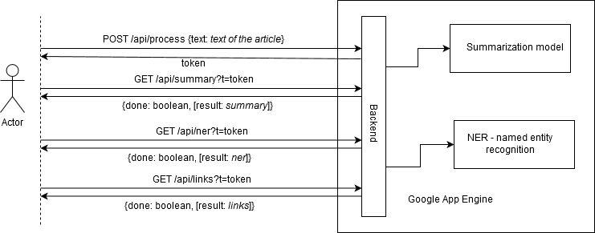

# articles-summary

Плагин извлекает ключевую информацию из текста на открытой странице и ищет релевантную информацию в интернете

Дизайна пока нет. Скорее всего будет выглядеть как боковая панель, расширяющаяся от правого края экрана. Внутри панели столбиком расположены логические части.

Какую информацию позволяет получить плагин:

Часто упоминаемые сущности (люди, места, даты)
Доп информация из гугла об этих сущностях
Summary - краткое содержание текста. Пока что качество таких саммари не очень высокое

## Фронтенд: 
определяет, какой текст на странице является главным
отправляет его на бэкэнд
проверяет результат, периодически отправляя запросы, либо держит открытым вебсокет TBD
после получения каждого отдельного блока - отображает его в боковой панели

Изначально панель скрыта - открывается только после получения первых результатов от бэка. До этого кнопка плагина в панели управления браузера отображает текущее состояние.

## Бэкэнд:
1. Ждёт запросы от фронта
2. При получении текста, возвращает токен, по которому фронт проверяет результаты
3. Начинает параллельно извлекать сущности/саммари/гуглить
4. При запросе с фронта возвращает обновления

Браузеры: Chromium, Safari, firefox(?)

## Технолоджис
Node.js + Python (для машин лёрнинг) на бэкенде, ебашим микросервисы докер+кубернетис на Google Cloud, сразу пишем тесты и настраиваем CI/DI
В кубернетис я пока что не умею, но интересно поучиться на простом примере. В ноде я тоже совсем немного разбирался, но думаю, прошарюсь.

## Зачем всё это:
Особого денежного выхлопа от этого проекта я не жду, но есть возможность
1. Сделать качественный проект, про который не стыдно рассказать.
2. Научиться друг у друга чему-то
3. Если удастся договориться с Розой (мой бывший шеф в стартапе), поучимся работать с пиндосами🇺🇸, ну и будем сами диктовать свои правила.

## Branches
Please use branch naming using the initials of a project name and an issue id. For example, if a project is `Articles Summary` and an issue id is `7` branch will be `AS-7`. 

Also please start all commit messages with issue id like `#7 initialize the package`.

## Launch
To use browser extension or start dev script please install node version >10, yarn, docker. Make `install` and `build:docker` script.

The Browser extension is compiled to `packages/browser-extensions/dist`.
##### install

`yarn`
##### dev
`yarn run start`
##### build
`yarn run build`

`yarn run build:docker`
##### check code style
`yarn run lint`

## Download to browser

## Google Cloud configuration
1. Install gcloud
2. Authenticate to your Google Account
`gcloud auth login`
3. Set project, it's necessary to deploy anything on App Engine
`gcloud config set project PROJECT_ID`

## Docker
To run NER processor locally
1. cd ./packages/ner 
2. docker build -t ner:v1.0 .
3. docker run -p 5001:5000 ner:v1.0 
